# ContinentalUSA Data Flow Architecture

## Overview
This document describes how data flows through the ContinentalUSA project, from external APIs through processing layers to client applications.

## High-Level Architecture Diagram

```mermaid
graph TB
    %% External APIs
    subgraph "External APIs"
        Tessie[Tessie API<br/>Vehicle Telemetry]
        Weather[Weather APIs<br/>OpenWeather/ABRP]
        Charging[Charging APIs<br/>SuperCharger Network]
        Maps[Map Services<br/>Mapbox]
    end

    %% Authentication & Storage
    subgraph "Authentication & Storage"
        Auth[Authentication<br/>Tesla OAuth/Tessie Token]
        KV[Cloudflare KV<br/>Cached Data & Tokens]
        D1[Cloudflare D1<br/>Persistent Storage]
    end

    %% Processing Layer
    subgraph "Processing Layer"
        EdgeWorker[Cloudflare Edge Worker<br/>API Gateway & Processing]
        MCP[MCP Server<br/>Tool Orchestration]
        SharedAPI[Shared API Manager<br/>Common Services]
        SharedCred[Shared Credential Manager<br/>Token Management]
    end

    %% Client Applications
    subgraph "Client Applications"
        WebApp[Public Site<br/>React/Vite App]
        MobileApp[Mobile App<br/>React Native/Expo]
        iOS[iOS Client<br/>Swift - BLACKLISTED]
    end

    %% Static Assets
    subgraph "Static Assets"
        StaticData[Static Data<br/>Itinerary/Route Files]
        Config[Configuration<br/>Environment Variables]
    end

    %% Data Flow Connections
    Tessie -->|VIN + Token Auth| EdgeWorker
    Weather -->|API Keys| EdgeWorker
    Charging -->|Public APIs| EdgeWorker
    Maps -->|Mapbox Token| WebApp
    Maps -->|Mapbox Token| MobileApp

    Auth -->|Tokens| KV
    KV -->|Cached Data| EdgeWorker
    D1 -->|Persistent Data| EdgeWorker

    EdgeWorker -->|Vehicle Data API| WebApp
    EdgeWorker -->|Vehicle Data API| MobileApp
    EdgeWorker -->|Tool Requests| MCP

    SharedAPI -->|Common Services| EdgeWorker
    SharedCred -->|Token Management| EdgeWorker
    SharedAPI -->|Type Definitions| WebApp
    SharedAPI -->|Type Definitions| MobileApp

    StaticData -->|Route/Itinerary| WebApp
    StaticData -->|Route/Itinerary| MobileApp
    Config -->|Environment| EdgeWorker
    Config -->|Environment| WebApp
    Config -->|Environment| MobileApp

    %% MCP Tool Integration
    MCP -->|GitHub Operations| EdgeWorker
    MCP -->|File System Access| EdgeWorker
    MCP -->|Browser Tools| EdgeWorker

    %% Style the blacklisted component
    iOS -.->|BLACKLISTED| EdgeWorker
    style iOS fill:#ff9999,stroke:#ff0000,stroke-width:3px,stroke-dasharray: 5 5
```



## Detailed Data Flow by Component

### 1. Vehicle Telemetry Data Flow (Primary)

**Source:** Tessie API (VIN + Token Authentication)
**Path:** 
```
Tessie API → Edge Worker → KV Cache → Client Apps
```

**Details:**
- **Authentication:** Uses `TESSIE_API_TOKEN` and `TESSIE_VIN` environment variables
- **Data Types:** Real-time vehicle state (battery, location, charging, climate)
- **Caching:** Edge Worker caches responses in Cloudflare KV for performance
- **Endpoints:** `/api/vehicle/data`, `/api/vehicle/stream`
- **Fallback:** Mock data when Tessie API is unavailable

### 2. Weather Data Flow

**Source:** OpenWeather API / ABRP Weather
**Path:**
```
Weather APIs → Edge Worker → Client Apps
```

**Details:**
- **Authentication:** API keys stored in environment variables
- **Data Types:** Current weather, forecasts for route planning
- **Integration:** Combined with vehicle location for contextual weather

### 3. Charging Station Data Flow

**Source:** SuperCharger Network APIs / ABRP
**Path:**
```
Charging APIs → Edge Worker → Client Apps
```

**Details:**
- **Data Types:** Station locations, availability, pricing
- **Integration:** Filtered by vehicle location and route

### 4. Map & Navigation Data Flow

**Source:** Mapbox APIs
**Path:**
```
Mapbox → Direct to Client Apps
```

**Details:**
- **Authentication:** Mapbox token configured in client apps
- **Data Types:** Map tiles, geocoding, routing
- **Note:** Direct integration, not proxied through Edge Worker

### 5. Static Data Flow

**Source:** Local JSON files
**Path:**
```
Static Files → Build Process → Client Apps
```

**Details:**
- **Files:** `itinerary.json`, route configurations
- **Processing:** Bundled during build process
- **Usage:** Trip planning, route visualization

## Component Responsibilities

### Edge Worker (Primary API Gateway)
- **Tessie API Integration:** Primary vehicle data source
- **API Aggregation:** Combines multiple data sources
- **Caching Strategy:** KV storage for performance
- **Error Handling:** Graceful fallbacks to mock data
- **Rate Limiting:** Manages API call frequency

### MCP Server (Tool Orchestration)
- **GitHub Integration:** Repository operations
- **File System Tools:** Local file management
- **Browser Automation:** Web scraping capabilities
- **Sequential Processing:** Task coordination

### Shared Components
- **API Manager:** Common API patterns and types
- **Credential Manager:** Secure token handling
- **Tessie Client:** Standardized Tessie API interface

### Client Applications

#### Public Site (React/Vite)
- **Data Sources:** Edge Worker APIs, Mapbox direct
- **Features:** Real-time dashboard, route visualization
- **Caching:** Browser cache for static assets

#### Mobile App (React Native/Expo)
- **Data Sources:** Edge Worker APIs, Mapbox direct
- **Features:** Native mobile interface, location services
- **Offline:** Local storage for essential data

#### iOS Client (BLACKLISTED)
- **Status:** Not currently maintained or integrated
- **Future:** Potential Swift native implementation

## API Endpoints

### Edge Worker Endpoints
- `GET /api/vehicle/data` - Current vehicle state (Tessie)
- `GET /api/vehicle/stream` - Real-time telemetry stream
- `GET /api/weather` - Weather data for location
- `GET /api/charging/stations` - Nearby charging stations
- `GET /api/trip/status` - Current trip information

### Data Formats
- **Vehicle Data:** Standardized interface across all consumers
- **Timestamps:** ISO 8601 format with timezone
- **Coordinates:** Decimal degrees (WGS84)
- **Units:** Metric system with conversion utilities

## Authentication Strategy

### Current Implementation
- **Tessie API:** Token-based authentication (VIN + API token)
- **External APIs:** API key authentication
- **Client Security:** Environment variable management

### Tesla API Integration (Future)
- **Status:** Not currently implemented
- **Reason:** Complex OAuth2 flow not yet required
- **Alternative:** Tessie provides sufficient Tesla data access

## Error Handling & Fallbacks

### Graceful Degradation
1. **Primary:** Live Tessie API data
2. **Secondary:** Cached KV data
3. **Tertiary:** Mock/static data
4. **Error States:** User-friendly error messages

### Monitoring & Logging
- **Edge Worker:** Console logging with structured data
- **Client Apps:** Error boundaries and user feedback
- **Performance:** API response time tracking

## Caching Strategy

### Cloudflare KV
- **Vehicle Data:** 30-second TTL for real-time feel
- **Weather Data:** 10-minute TTL for freshness
- **Static Data:** 1-hour TTL for stability

### Client-Side Caching
- **Browser Cache:** Static assets and API responses
- **Mobile Storage:** Essential data for offline access

## Security Considerations

### API Security
- **Token Management:** Environment variables only
- **CORS:** Restricted to known origins
- **Rate Limiting:** Per-IP and per-endpoint limits

### Data Privacy
- **Vehicle Data:** No persistent storage of sensitive telemetry
- **User Data:** Minimal collection, secure transmission
- **Compliance:** Following automotive data standards

## Performance Optimizations

### Edge Computing
- **Geographic Distribution:** Cloudflare edge locations
- **Response Time:** Sub-100ms for cached data
- **Scalability:** Auto-scaling based on demand

### Data Compression
- **API Responses:** Gzip compression enabled
- **Static Assets:** Optimized during build process
- **Images:** WebP format with fallbacks

## Future Architecture Considerations

### Planned Enhancements
1. **Real-time WebSocket streams** for live telemetry
2. **Machine learning integration** for predictive analytics
3. **Multi-vehicle support** for fleet management
4. **Enhanced offline capabilities** for mobile apps

### Scalability Roadmap
1. **Database Migration:** From KV to full database for complex queries
2. **Microservices:** Split Edge Worker into specialized services
3. **CDN Optimization:** Advanced caching strategies
4. **Monitoring:** Comprehensive observability stack

---

*Last Updated: Current*
*Architecture Status: Production Ready (excluding iOS client)*
subscribers      → Email notification subscribers
telemetry_cache  → Recent vehicle data for quick access
```

### Durable Objects
```
SYNC_SERVICE_DO  → Real-time sync coordination
Vehicle Streams  → WebSocket connection management
```

## Data Flow Paths

### 1. Real-Time Vehicle Tracking
```
Tesla Vehicle → Tessie API → Edge Worker → KV/D1 Cache → WebSocket → Client Apps
                             ↓
                        Map Updates → Mobile/Web UI
```

### 2. Trip Itinerary Management
```
Static JSON → ITINERARY_KV → Edge Worker API → Client Apps
                ↓
         Geolocation Services → Map Rendering
```

### 3. User Engagement Flow
```
Web Forms → Edge Worker → D1/KV Storage → Email Service → Notifications
                                           ↓
                                    Newsletter Updates
```

### 4. Map & Navigation Data
```
Base Map Tiles → MAP_TILES_KV (cached) → Web/Mobile Map Components
Current Location → Real-time Updates → Route Optimization
Trip Waypoints → Itinerary API → Navigation Display
```

## Application Components & Data Consumption

### Edge Worker (Cloudflare) - Data Hub
**File**: `edge-worker/src/index.ts`
**Role**: Central data orchestration
**Data In**:
- Tessie API responses
- User form submissions
- Client requests
**Data Out**:
- REST API endpoints
- WebSocket streams
- Cached responses

**Key Endpoints**:
- `/api/itinerary` - Trip data
- `/api/vehicle/data` - Real-time telemetry  
- `/api/vehicle/stream` - WebSocket for live updates
- `/api/subscribe` - Email subscriptions

### Public Website (48Continental_Starter/public-site)
**Framework**: Vite + React
**Data Sources**:
- Edge Worker APIs
- Direct KV access (some static content)
**Data Consumption**:
- Trip itinerary for map display
- Real-time vehicle location
- User subscription management

**Key Components**:
- `Map.jsx` - Live tracking display
- `ChargingStationCard.jsx` - Station information
- Forms for email subscription

### Mobile App (ContinentalUSA-mobile)
**Framework**: React Native + Expo
**Data Sources**:
- Edge Worker APIs
- Device location services
- AsyncStorage for offline data
**Data Consumption**:
- Real-time vehicle tracking
- Trip progress monitoring  
- Push notifications
- Offline map caching

**Key Features**:
- Live dashboard with battery/location
- Interactive trip map
- Settings for notifications

### Shared Libraries
**Purpose**: Common data interfaces and utilities
**Components**:
- `shared/tessie/` - Tessie API client
- `shared/api-manager/` - HTTP request utilities
- `shared/credential-manager/` - Secure token handling

## Data Transformation Points

### 1. Tessie API → Internal Format
**Location**: `shared/tessie/tessieClient.ts`
**Transform**: Tessie response → `VehicleData` interface
**Fields**: Location, battery, climate, vehicle state

### 2. Static Itinerary → Live Data
**Location**: `edge-worker/src/itinerary.ts`
**Transform**: JSON file → KV storage → REST API
**Enhancement**: Add real-time progress tracking

### 3. Raw Telemetry → Client Format
**Location**: `edge-worker/src/vehicle-stream.ts`
**Transform**: Vehicle data → WebSocket messages
**Optimization**: Throttling, compression for mobile

## Security & Access Control

### API Authentication
- Edge Worker: HMAC signature verification
- Tessie API: Token-based authentication
- Internal APIs: JWT tokens (planned)

### Data Privacy
- Vehicle tokens never exposed to clients
- User data stored securely in D1/KV
- HTTPS/WSS for all data transmission

## Performance Optimizations

### Caching Strategy
- **KV Storage**: Static itinerary, map tiles, API responses
- **D1 Database**: Frequently accessed vehicle data
- **Client Side**: AsyncStorage (mobile), localStorage (web)

### Real-Time Updates
- **WebSocket Streams**: Live vehicle data
- **Polling Fallback**: HTTP requests if WS fails
- **Data Throttling**: Limit update frequency

## Error Handling & Resilience

### Fallback Mechanisms
- D1 → KV storage fallback
- Tessie API → Tesla API fallback (future)
- WebSocket → HTTP polling fallback
- Online → Offline mode (cached data)

### Data Validation
- Type checking with TypeScript interfaces
- API response validation
- Client-side error boundaries

## Future Enhancements

### Planned Data Sources
- Tesla API direct integration (OAuth2 flow)
- Weather API integration
- Traffic/routing APIs
- Supercharger network APIs

### Advanced Features
- Predictive route optimization
- Real-time traffic integration
- Social features (sharing progress)
- Historical trip analytics

## Monitoring & Observability

### Data Flow Tracking
- Edge Worker logs in Cloudflare
- Client-side error reporting
- API response time monitoring
- WebSocket connection health

### Performance Metrics
- KV/D1 response times
- API call success rates
- Client app performance
- Real-time update latency

---

## Summary

The 48 Continental USA application follows a **hub-and-spoke architecture** with the Cloudflare Edge Worker as the central data hub. Vehicle telemetry flows from Tessie API through the edge worker to multiple client applications via REST APIs and WebSocket streams. The system is designed for resilience with multiple fallback mechanisms and optimized for performance with strategic caching at every layer.

**Primary Data Flow**: `Tessie API → Edge Worker → KV/D1 Storage → Client Apps`
**Real-Time Flow**: `Vehicle → Tessie → WebSocket Stream → Live UI Updates`
**Static Data Flow**: `JSON Files → KV Storage → API Endpoints → Client Rendering`
