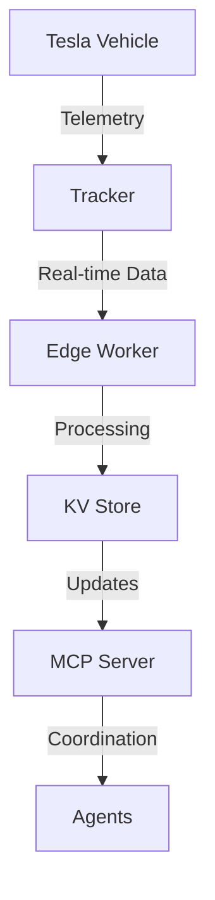
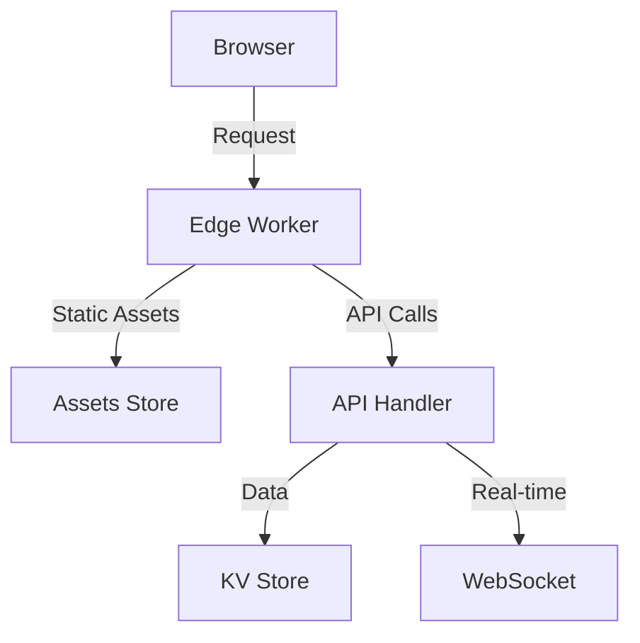
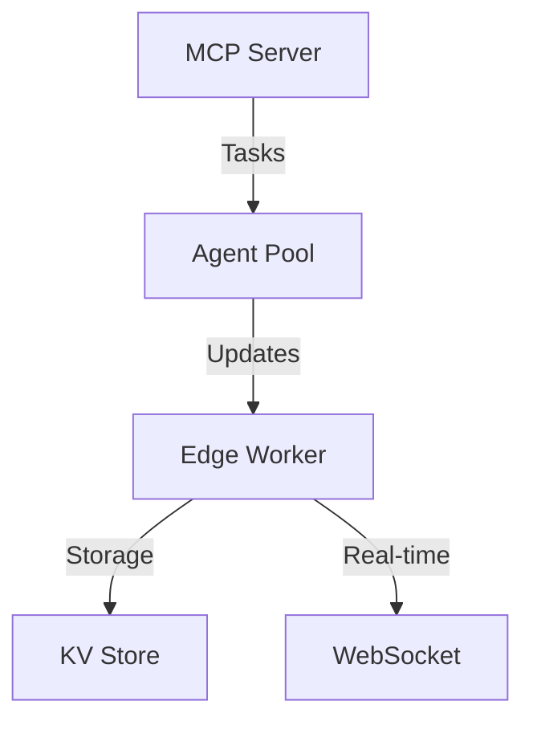

# Cloudflare Pages to Workers Migration Strategy

## Overview
This document outlines the strategy for migrating the 48 Continental USA tracking application from Cloudflare Pages to Workers after the current deployment cycle. This migration will provide access to additional features like Durable Objects, Cron Triggers, and enhanced observability that will benefit our real-time tracking and multi-system coordination needs.

## Critical Systems
Before beginning migration, ensure these critical systems are documented and functional:
1. **Tesla Telemetry System**
   - Current tracker implementation
   - Real-time data flow
   - Backup data storage
   - Failover mechanisms

2. **Edge Infrastructure**
   - Current Cloudflare Workers setup
   - KV store contents and structure
   - WebSocket connections
   - Edge caching configuration

3. **MCP (Mission Control Platform)**
   - Server status and configuration
   - Agent coordination system
   - Task scheduling system
   - Telemetry buffer system

4. **Data Synchronization**
   - Current sync mechanisms
   - Data validation processes
   - Conflict resolution strategies
   - Backup procedures

## Pre-Migration Checklist

### System Status Verification
- [ ] Complete current deployment cycle
- [ ] Verify all system components are operational:
  - [ ] Tesla tracker sending telemetry
  - [ ] Edge infrastructure processing requests
  - [ ] MCP server coordinating agents
  - [ ] Real-time data flow working
  - [ ] WebSocket connections stable
  - [ ] KV stores accessible
  - [ ] Durable Objects functioning

### Documentation and Backup
- [ ] Back up all Pages configurations
- [ ] Document current Pages Functions and routes
- [ ] Export KV store data
- [ ] Backup all environment variables and secrets
- [ ] Document WebSocket connection handling
- [ ] Catalog all custom domains and DNS settings
- [ ] Map all data flow paths
- [ ] Document all API endpoints and their usage
- [ ] List all active background processes
- [ ] Screenshot current monitoring dashboards

### Safety Measures
- [ ] Create system state snapshot
- [ ] Set up monitoring alerts
- [ ] Prepare rollback scripts
- [ ] Test backup restoration process
- [ ] Document emergency contact procedures
- [ ] Create incident response plan

## Migration Steps

### 0. Pre-Migration Testing
- Create a parallel test environment
- Clone all necessary configurations
- Set up monitoring for both systems
- Test data flow in isolation
- Verify all critical paths

### 1. Framework Adaptation
- Identify and update framework-specific adaptors
- Replace Pages-specific configurations with Workers equivalents
- Update build processes if needed

### 2. Wrangler Configuration
```toml
name = "continental-usa"
compatibility_date = "2025-06-09"

[assets]
directory = "./dist/client/"
binding = "ASSETS"
run_worker_first = true  # Required for authentication/logging

[placement]
mode = "smart"
```

### 3. Asset Management
Create `.assetsignore`:
```
**/node_modules
**/.DS_Store
**/.git
```

### 4. Functions Migration
- Compile Pages Functions:
```bash
npx wrangler pages functions build --outdir=./dist/worker/
```
- Consider migrating to HonoX for file-based routing

### 5. Environment Configuration

#### Runtime Variables
```toml
# wrangler.toml
[vars]
TESLA_API_ENABLED = true
WEBSOCKET_ENABLED = true
MAP_UPDATES_INTERVAL = "5000"
```

#### Required Secrets
- `TESLA_API_KEY`: Tesla API authentication
- `CLOUDFLARE_API_TOKEN`: CF API access
- `MCP_SECRET_KEY`: MCP server authentication
- `WEBHOOK_SECRET`: Webhook verification
- `TESSIE_API_KEY`: Tessie integration

#### Local Development
```env
# .dev.vars
TESLA_API_KEY=your_test_key
CLOUDFLARE_API_TOKEN=your_test_token
MCP_SECRET_KEY=your_test_key
WEBHOOK_SECRET=your_test_secret
TESSIE_API_KEY=your_test_key
```

#### Production Configuration
1. Use Wrangler secret commands:
   ```bash
   wrangler secret put TESLA_API_KEY
   wrangler secret put CLOUDFLARE_API_TOKEN
   wrangler secret put MCP_SECRET_KEY
   wrangler secret put WEBHOOK_SECRET
   wrangler secret put TESSIE_API_KEY
   ```
2. Verify in Cloudflare dashboard
3. Test secret access in preview deployment

### 6. CI/CD Transition
1. Connect repository to Workers Builds
2. Configure build environment variables
3. Enable non-production branch builds
4. Set up preview URLs

### 7. Validation Process

#### Component Testing
1. Test in preview environment:
   - Static asset serving
   - API endpoints
   - WebSocket connections
   - KV store access
   - Durable Objects
   - Background tasks

2. Route Verification:
   - All API endpoints responding
   - Middleware functioning
   - Authentication working
   - Rate limiting applied
   - Error handling correct

3. Data Flow Testing:
   - Tesla telemetry receiving
   - Real-time updates working
   - Map updates functioning
   - WebSocket stability
   - Data synchronization
   - Backup systems operational

4. Performance Validation:
   - Response times acceptable
   - Memory usage stable
   - CPU usage within limits
   - Network latency acceptable
   - Error rates minimal

5. Security Checks:
   - All secrets properly stored
   - Authentication working
   - Rate limiting effective
   - CORS properly configured
   - SSL/TLS validated

6. Integration Testing:
   - MCP communication stable
   - Agent coordination working
   - Task scheduling functional
   - Alerts/monitoring active
   - Logging system working

### 8. Rollout Plan
1. Enable Workers configuration
2. Validate all functionality
3. Update DNS settings
4. Monitor for 24-48 hours
5. Remove Pages project

## Feature Compatibility Matrix

| Feature | Status | Notes |
|---------|--------|-------|
| Static Assets | ✅ | Direct migration |
| API Routes | ✅ | May need restructuring |
| Preview Deployments | ✅ | Workers Builds |
| Custom Domains | ✅ | Requires Cloudflare nameservers |
| Environment Variables | ✅ | Separate runtime/build configs |
| Middleware | ✅ | Use `run_worker_first` |

## Advanced Features Available After Migration
- Durable Objects for state management
- Cron Triggers for scheduled tasks
- Enhanced logging and observability
- Queue Producers/Consumers
- Rate Limiting capabilities
- Source Maps support

## Rollback Strategy
1. Maintain Pages configuration until confirmed stability
2. Keep DNS records documented
3. Monitor error rates during transition
4. Maintain deployment history for quick reversion

## Post-Migration Tasks
- [ ] Update documentation
- [ ] Clean up unused Pages resources
- [ ] Update deployment scripts
- [ ] Train team on Workers-specific features
- [ ] Update monitoring and logging
- [ ] Review and optimize Worker performance

## Critical Paths

### 1. Tesla Data Flow


### 2. Web Application Flow


### 3. MCP Coordination


## Emergency Procedures

### Quick Rollback
1. Revert DNS settings
2. Restore KV backups
3. Re-enable Pages project
4. Verify data integrity
5. Check system status

### System Recovery
1. Stop all writes to KV
2. Verify data consistency
3. Replay missing operations
4. Restore from backups
5. Verify system state
6. Resume operations

### Contact Information
- Primary On-call: [Contact Info]
- Backup Contact: [Contact Info]
- Cloudflare Support: [Account Info]
- Tesla API Support: [Contact Info]

## Build Optimization

### Chunk Strategy
The application uses a strategic chunk splitting approach to optimize loading performance:

```js
// Chunk configuration in vite.config.js
manualChunks: {
  // Core React libraries
  vendor: ["react", "react-dom", "react-router-dom"],
  // Map functionality
  maps: ["mapbox-gl", "@mapbox/mapbox-gl-draw"],
  // UI components
  ui: ["@mui/material", "@emotion/react", "@emotion/styled"],
  // Data management
  data: ["zustand", "swr", "@tanstack/react-query"]
}
```

### Performance Optimizations
- Increased chunk size warning limit to 1000kb
- Implemented strategic code splitting
- Optimized vendor chunk bundling
- Enabled production minification with Terser
- Configured source maps for debugging
- Organized chunks into logical groups

### Build Configuration Details
- Used manual chunk splitting for better control
- Separated vendor dependencies
- Implemented dynamic imports for route-based code splitting
- Optimized chunk naming and organization
- Removed console logs in production
- Enabled aggressive dead code elimination

## Notes
- Workers requires Cloudflare nameservers for custom domains
- Different environment variable handling between build and runtime
- Preview URLs configuration differs from Pages
- Consider using Wrangler Environments for staging/production
- Maintain KV store backups
- Monitor WebSocket connection stability
- Keep telemetry buffer system active
- Ensure MCP server high availability
- Configure appropriate chunk size warnings
- Monitor bundle sizes in CI/CD pipeline
