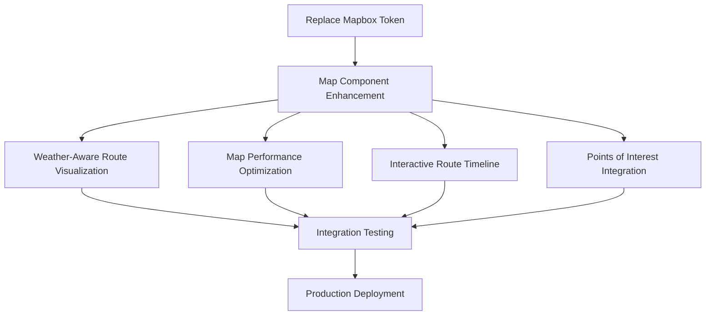

# Map-Priority Workflow for "A Whittle Wandering" Project

## Overview
This workflow document outlines the map-centric approach for completing the "A Whittle Wandering" project. It establishes parallel development streams with an emphasis on map functionality as the critical path.

## Critical Path Dependencies

## Parallel Workflows

### Stream 1: Core Map Functionality
* **Team:** MapBox specialists
* **Priority:** HIGHEST
* **Focus:** Rendering, performance, interactions
* **Dependencies:** None - starts immediately

### Stream 2: Weather Integration
* **Team:** Weather API specialists + MapBox routing experts
* **Priority:** HIGH
* **Focus:** Route alternatives, weather overlays
* **Dependencies:** Basic map functionality working

### Stream 3: UI/UX Enhancements
* **Team:** Frontend specialists
* **Priority:** MEDIUM
* **Focus:** Timeline controls, mobile optimization
* **Dependencies:** Core map functionality

### Stream 4: Rebranding & Deployment
* **Team:** DevOps specialists
* **Priority:** MEDIUM
* **Focus:** Token replacement, environment setup
* **Dependencies:** None - starts in parallel with Stream 1

## Daily Workflow

### Morning Coordination
* 15-minute standup with all teams
* Review blockers and dependencies
* Adjust parallel streams as needed

### Mid-day Checkpoints
* Component-specific progress reviews
* Integration testing of completed components
* Resource reallocation based on progress

### End-of-day Reviews
* Merge completed components to development branch
* Automated testing of integrated components
* Documentation updates for completed work

## Emergency Procedures

### Map Rendering Issues
1. Immediately involve MapBox specialist
2. Roll back to last known working version
3. Create isolated test environment to debug
4. Implement and test fix before reintegration

### API Integration Failures
1. Switch to mock data temporarily
2. Diagnose API connection issues
3. Contact API provider if necessary
4. Implement more robust error handling

## Completion Criteria

### Map Functionality
* Renders correctly across all target browsers/devices
* Displays vehicle position with accurate coordinates
* Shows route with weather-based alternatives
* Maintains 60fps performance on reference hardware
* Successfully renders all POIs and information overlays

### Weather Integration
* Retrieves and displays current weather data
* Updates at appropriate intervals
* Correctly influences route recommendations
* Visually indicates weather conditions on map

### Timeline Controls
* Synchronizes with map position
* Allows scrubbing through journey history
* Displays appropriate information at each point
* Works responsively on all target devices
