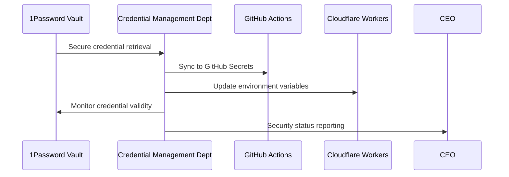

# 48 Continental USA - Enterprise-Grade Agent Architecture

This document defines the enterprise-grade hierarchical agent architecture for the 48 Continental USA project. The system is designed as a cloud-only implementation with a clear organizational structure mirroring corporate hierarchies.

## Enterprise Hierarchy

```mermaid
graph TD
    CEO[CEO Agent - Strategic Oversight]
    
    SLT1[SLT - Operations]
    SLT2[SLT - Infrastructure]
    SLT3[SLT - User Experience]
    SLT4[SLT - Security & Compliance]
    
    DH1[Dept Head - Trip Management]
    DH2[Dept Head - Vehicle Systems]
    DH3[Dept Head - Cloud Services]
    DH4[Dept Head - API Integrations]
    DH5[Dept Head - Analytics]
    DH6[Dept Head - UI/UX]
    DH7[Dept Head - Security]
    DH8[Dept Head - Credential Management]
    
    M1[Manager - Route Planning]
    M2[Manager - Charging Strategy]
    M3[Manager - Vehicle Telemetry]
    M4[Manager - Battery Optimization]
    M5[Manager - CloudFlare Resources]
    M6[Manager - State Management]
    M7[Manager - Tesla API]
    M8[Manager - MapBox API]
    M9[Manager - Weather API]
    M10[Manager - Predictive Analytics]
    M11[Manager - User Journey]
    M12[Manager - Performance]
    M13[Manager - Authentication]
    M14[Manager - Key Rotation]
    M15[Manager - Story Development]
    M16[Manager - Media Assets]
    
    W1[Sequential Thinking MCP]
    W2[Route Optimization MCP]
    W3[Charging Prediction MCP]
    W4[Vehicle Status MCP]
    W5[Battery Analysis MCP]
    W6[Energy Efficiency MCP]
    W7[KV Storage MCP]
    W8[Durable Objects MCP]
    W9[Filesystem MCP]
    W10[Tesla Auth MCP]
    W11[Tesla Commands MCP]
    W12[MapBox Routing MCP]
    W13[MapBox Geocoding MCP]
    W14[Weather Forecast MCP]
    W15[Weather Alerts MCP]
    W16[Trip Prediction MCP]
    W17[Energy Modeling MCP]
    W18[State Visit MCP]
    W19[Web UI MCP]
    W20[iOS UI MCP]
    W21[Performance Monitoring MCP]
    W22[Browser Tools MCP]
    W23[1Password Connect MCP]
    W24[GitHub Actions MCP]
    W25[Encryption MCP]
    W26[Story Generation MCP]
    W27[Journal Entry MCP]
    W28[Photo Management MCP]
    W29[Video Processing MCP]
    
    CEO --> SLT1
    CEO --> SLT2
    CEO --> SLT3
    CEO --> SLT4
    
    SLT1 --> DH1
    SLT1 --> DH2
    SLT2 --> DH3
    SLT2 --> DH4
    SLT3 --> DH6
    SLT3 --> DH5
    SLT4 --> DH7
    SLT4 --> DH8
    
    DH1 --> M1
    DH1 --> M2
    DH2 --> M3
    DH2 --> M4
    DH3 --> M5
    DH3 --> M6
    DH4 --> M7
    DH4 --> M8
    DH4 --> M9
    DH5 --> M10
    DH6 --> M11
    DH6 --> M12
    DH7 --> M13
    DH8 --> M14
    DH6 --> M15
    DH6 --> M16
    
    M1 --> W1
    M1 --> W2
    M2 --> W3
    M3 --> W4
    M4 --> W5
    M4 --> W6
    M5 --> W7
    M5 --> W8
    M5 --> W9
    M7 --> W10
    M7 --> W11
    M8 --> W12
    M8 --> W13
    M9 --> W14
    M9 --> W15
    M10 --> W16
    M10 --> W17
    M10 --> W18
    M11 --> W19
    M11 --> W20
    M12 --> W21
    M12 --> W22
    M14 --> W23
    M14 --> W24
    M13 --> W25
    M15 --> W26
    M15 --> W27
    M16 --> W28
    M16 --> W29
```



## Hierarchical Responsibilities

### Executive Level

#### CEO Agent
- **Primary Role**: Strategic oversight and critical decision-making
- **Responsibilities**:
  - Sets overall trip goals and mission parameters
  - Approves major route changes or itinerary adjustments
  - Final authority on safety and operational decisions
  - Resource allocation across all departments
  - Executive-level progress reporting

### Senior Leadership Team (SLT)

#### Operations SLT
- **Primary Role**: Oversees all trip management and vehicle operations
- **Responsibilities**:
  - Trip logistics coordination
  - Vehicle performance optimization
  - Real-time operational adjustments
  - Resource allocation within operations departments

#### Infrastructure SLT
- **Primary Role**: Manages cloud infrastructure and integration points
- **Responsibilities**:
  - Cloudflare Workers deployment strategy
  - State management architecture
  - API integration coordination
  - Performance optimization of cloud resources

#### User Experience SLT
- **Primary Role**: Directs all user interfaces and content creation
- **Responsibilities**:
  - Multi-platform UI/UX consistency
  - User journey optimization
  - Trip storytelling and media management
  - Performance metrics for user interfaces

#### Security & Compliance SLT
- **Primary Role**: Handles security, authentication, and credential management
- **Responsibilities**:
  - Secure API access policies
  - Credential rotation and management
  - 1Password integration oversight
  - Encryption standards enforcement

### Department Heads

#### Trip Management Department
- Route planning strategy and optimization
- Charging stop coordination and prediction
- Route adjustments based on real-time conditions
- Itinerary adherence and state collection tracking

#### Vehicle Systems Department
- Tesla vehicle telemetry integration
- Battery management and optimization
- Performance monitoring and diagnostics
- Vehicle command interface management

#### Cloud Services Department
- Cloudflare Workers deployment and management
- KV storage and Durable Objects architecture
- State persistence and synchronization
- Cloud resource allocation and scaling

#### API Integrations Department
- External API integration (Tesla, MapBox, Weather, ABRP)
- API response normalization and processing
- Rate limiting and quota management
- API fallback strategies

#### Analytics Department
- Predictive modeling for trip optimization
- Energy consumption analysis
- State visit tracking and statistics
- Trip progress visualization data

#### UI/UX Department
- Web interface development and optimization
- iOS interface implementation
- Cross-platform design consistency
- Media assets and trip story visualization

#### Security Department
- Authentication mechanisms
- Secure communication between components
- Encryption of sensitive data
- Security auditing and monitoring

#### Credential Management Department
- 1Password integration and synchronization
- GitHub Secrets management
- Cloudflare environment variables
- Credential rotation and validity monitoring

### Managers and Worker MCPs

Each department has specialized managers overseeing worker MCPs that execute specific functions. For example:

#### Route Planning Manager
- **Sequential Thinking MCP**: Complex problem solving for route decisions
- **Route Optimization MCP**: Real-time route adjustments and planning

#### 1Password Integration Manager
- **1Password Connect MCP**: Secure credential retrieval and management
- **GitHub Actions MCP**: CI/CD pipeline integration for secret management

## Cloud-Only Implementation

All components of the 48 Continental USA project are implemented as cloud-based services:

### Cloudflare Workers Platform
- All MCPs are deployed as Cloudflare Workers
- Global edge computing ensures low-latency access from any location
- Automatic scaling based on demand
- Built-in redundancy and failover mechanisms

### State Management
- **Cloudflare KV**: Persistent key-value storage for state management
- **Durable Objects**: Consistent, coordinated state for complex operations
- **R2 Storage**: Media asset storage for trip documentation

### Event-Driven Architecture
- Asynchronous communication between hierarchical layers
- Pub/sub patterns for event propagation
- Event sourcing for audit trails and system history

## 1Password Security Integration

The enterprise architecture includes a comprehensive security layer powered by 1Password:

### Credential Management
- **1Password Service Account**: Automated credential retrieval
- **GitHub Secrets Integration**: Syncs credentials to CI/CD pipeline
- **Cloudflare Environment Variables**: Updates runtime credentials
- **Key Rotation**: Automatic credential rotation and validity checking

### Security Workflow


## Multi-Interface Approach

The system exposes multiple interfaces with the website as the priority:

### Web Interface (Priority)
- Real-time trip tracking and visualization
- Interactive map with vehicle location
- Trip statistics and state collection progress
- Email subscription for updates
- Responsive design for all devices

### iOS Application
- Native iOS experience for trip tracking
- Offline capabilities for remote areas
- Push notifications for important events
- Apple Watch companion for quick stats

### API Interface
- OpenAPI-specified REST endpoints
- HMAC-signed payloads for security
- Rate-limited public access
- Webhook capabilities for integrations

## Decision Authority Matrix

| Decision Type | Authority Level | Escalation Path |
|---------------|----------------|-----------------|
| Route Changes | Trip Management Department | Operations SLT |
| Safety Critical | Vehicle Systems Department → CEO | Immediate |
| Content Publishing | UI/UX Department | User Experience SLT |
| API Authentication | Security Department | Security & Compliance SLT |
| Resource Allocation | Infrastructure SLT | CEO |
| Credential Rotation | Credential Management Department | Security & Compliance SLT |

## Communication Patterns

### Upward Flow
- Worker agents report status, exceptions, and completion to their managers
- Managers aggregate and contextualize information for department heads
- Department heads provide summarized operational status to SLT
- SLT delivers strategic insights and critical issues to CEO

### Downward Flow
- CEO issues strategic directives and priorities
- SLT translates strategy into departmental objectives
- Department heads create tactical plans and allocate resources
- Managers oversee specific function areas and direct worker agents
- Worker agents execute specialized tasks and functions

## MCP Server Implementation

The MCP servers are implemented using the Model Context Protocol (MCP) framework:

```javascript
// Example: Sequential Thinking MCP implementation
class SequentialThinkingServer {
  constructor() {
    this.server = new Server(
      {
        name: 'sequential-thinking-server',
        version: '1.0.0',
      },
      {
        capabilities: {
          tools: {},
        },
      }
    );

    this.setupToolHandlers();
    
    // Error handling
    this.server.onerror = (error) => console.error('[MCP Error]', error);
    process.on('SIGINT', async () => {
      await this.server.close();
      process.exit(0);
    });
  }

  // Tool handlers implementation
  setupToolHandlers() {
    // Tool registration and handling logic
    // ...
  }

  // Server runtime
  async run() {
    const transport = new StdioServerTransport();
    await this.server.connect(transport);
    console.error('Sequential Thinking MCP server running on stdio');
  }
}
```

## CI/CD Integration

The enterprise architecture includes comprehensive CI/CD workflows:

```yaml
# 1Password Enterprise Integration Workflow
name: 1Password Enterprise Integration

on:
  workflow_dispatch:
  schedule:
    - cron: "0 */6 * * *"  # Run every 6 hours

jobs:
  credential-sync:
    runs-on: ubuntu-latest
    permissions:
      contents: read
      id-token: write

    steps:
      - name: Checkout repository
        uses: actions/checkout@v3

      - name: Setup 1Password CLI
        uses: 1password/load-secrets-action@v1
        with:
          export-env: true
        env:
          OP_SERVICE_ACCOUNT_TOKEN: ${{ secrets.ONEPASSWORD_TOKEN }}

      # Additional steps for credential management
      # ...
```

## Conclusion

The 48 Continental USA project implements an enterprise-grade, cloud-only agent architecture with a clear hierarchical structure. This architecture ensures:

1. **Clear Authority**: Well-defined decision-making paths
2. **Specialization**: Focused departments and worker MCPs
3. **Security**: Comprehensive credential management
4. **Scalability**: Cloud-based infrastructure that scales with demand
5. **Resilience**: Redundant systems and failover mechanisms
6. **User Focus**: Priority on web interface for public engagement
