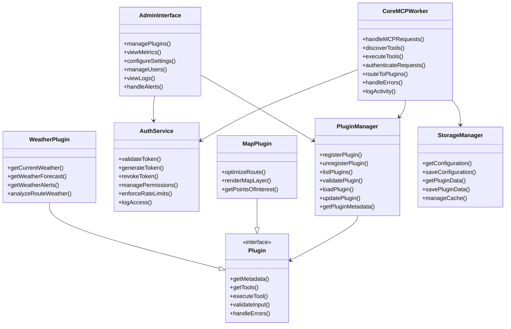

# Core Components Class Diagram

This diagram illustrates the core components of the MCP Server and their relationships. It shows the main classes, interfaces, and services that make up the system.

## Component Descriptions

### CoreMCPWorker

The central component that implements the Model Context Protocol and handles all interactions with ChatGPT.

**Responsibilities**:
- Handling MCP requests from ChatGPT
- Tool discovery and execution
- Authentication and validation
- Error handling
- Routing to plugins
- Logging and monitoring

**Methods**:
- `handleMCPRequests()`: Processes incoming MCP requests
- `discoverTools()`: Lists available tools for discovery requests
- `executeTools()`: Executes requested tools
- `authenticateRequests()`: Validates authentication tokens
- `routeToPlugins()`: Routes requests to appropriate plugins
- `handleErrors()`: Manages error handling and responses
- `logActivity()`: Logs system activity for monitoring

### PluginManager

Manages the plugin ecosystem, handling registration, discovery, and lifecycle management.

**Responsibilities**:
- Plugin registration and discovery
- Plugin validation
- Plugin loading and unloading
- Version management
- Dependency resolution

**Methods**:
- `registerPlugin()`: Registers a new plugin
- `unregisterPlugin()`: Removes a plugin from the registry
- `listPlugins()`: Returns a list of available plugins
- `validatePlugin()`: Validates plugin structure and dependencies
- `loadPlugin()`: Loads a plugin into memory
- `updatePlugin()`: Updates an existing plugin
- `getPluginMetadata()`: Retrieves metadata about a plugin

### AuthService

Handles all security aspects of the system, including authentication, authorization, and rate limiting.

**Responsibilities**:
- Token validation
- Permission management
- Rate limiting
- Access logging
- Security policies

**Methods**:
- `validateToken()`: Validates an authentication token
- `generateToken()`: Creates a new authentication token
- `revokeToken()`: Revokes an authentication token
- `managePermissions()`: Manages user permissions
- `enforceRateLimits()`: Enforces rate limits for API usage
- `logAccess()`: Logs access attempts for security auditing

### AdminInterface

Provides an administrative interface for managing the system.

**Responsibilities**:
- Plugin management
- Metrics visualization
- System configuration
- User management
- Log viewing
- Alert handling

**Methods**:
- `managePlugins()`: Interface for managing plugins
- `viewMetrics()`: Visualizes system metrics
- `configureSettings()`: Configures system settings
- `manageUsers()`: Manages user accounts and permissions
- `viewLogs()`: Views system logs
- `handleAlerts()`: Handles system alerts

### Plugin (Interface)

The interface that all plugins must implement.

**Responsibilities**:
- Defining plugin metadata
- Exposing tools
- Executing tool operations
- Validating input
- Handling errors

**Methods**:
- `getMetadata()`: Returns plugin metadata (name, version, etc.)
- `getTools()`: Returns a list of tools provided by the plugin
- `executeTool()`: Executes a tool operation
- `validateInput()`: Validates input parameters
- `handleErrors()`: Handles plugin-specific errors

### MapPlugin

A plugin that provides mapping and routing capabilities.

**Responsibilities**:
- Route optimization
- Map rendering
- Points of interest lookup

**Methods**:
- `optimizeRoute()`: Optimizes a route based on various parameters
- `renderMapLayer()`: Renders a map layer
- `getPointsOfInterest()`: Finds points of interest near a location

### WeatherPlugin

A plugin that provides weather data and forecasting.

**Responsibilities**:
- Current weather conditions
- Weather forecasting
- Weather alerts
- Route weather analysis

**Methods**:
- `getCurrentWeather()`: Gets current weather for a location
- `getWeatherForecast()`: Gets weather forecast for a location
- `getWeatherAlerts()`: Gets weather alerts for a location
- `analyzeRouteWeather()`: Analyzes weather conditions along a route

### StorageManager

Manages data persistence across the system.

**Responsibilities**:
- Configuration storage
- Plugin data storage
- Cache management
- State persistence

**Methods**:
- `getConfiguration()`: Retrieves system configuration
- `saveConfiguration()`: Saves system configuration
- `getPluginData()`: Retrieves plugin-specific data
- `savePluginData()`: Saves plugin-specific data
- `manageCache()`: Manages data caching

## Relationships

1. **CoreMCPWorker depends on PluginManager, AuthService, and StorageManager**:
   - The CoreMCPWorker uses the PluginManager to route requests to plugins.
   - It uses the AuthService to authenticate and authorize requests.
   - It uses the StorageManager to persist data and configuration.

2. **PluginManager depends on Plugin**:
   - The PluginManager manages instances of objects implementing the Plugin interface.

3. **MapPlugin and WeatherPlugin implement Plugin**:
   - These concrete plugin implementations provide specific functionality.

4. **AdminInterface depends on PluginManager and AuthService**:
   - The AdminInterface uses the PluginManager to manage plugins.
   - It uses the AuthService to manage users and permissions.
