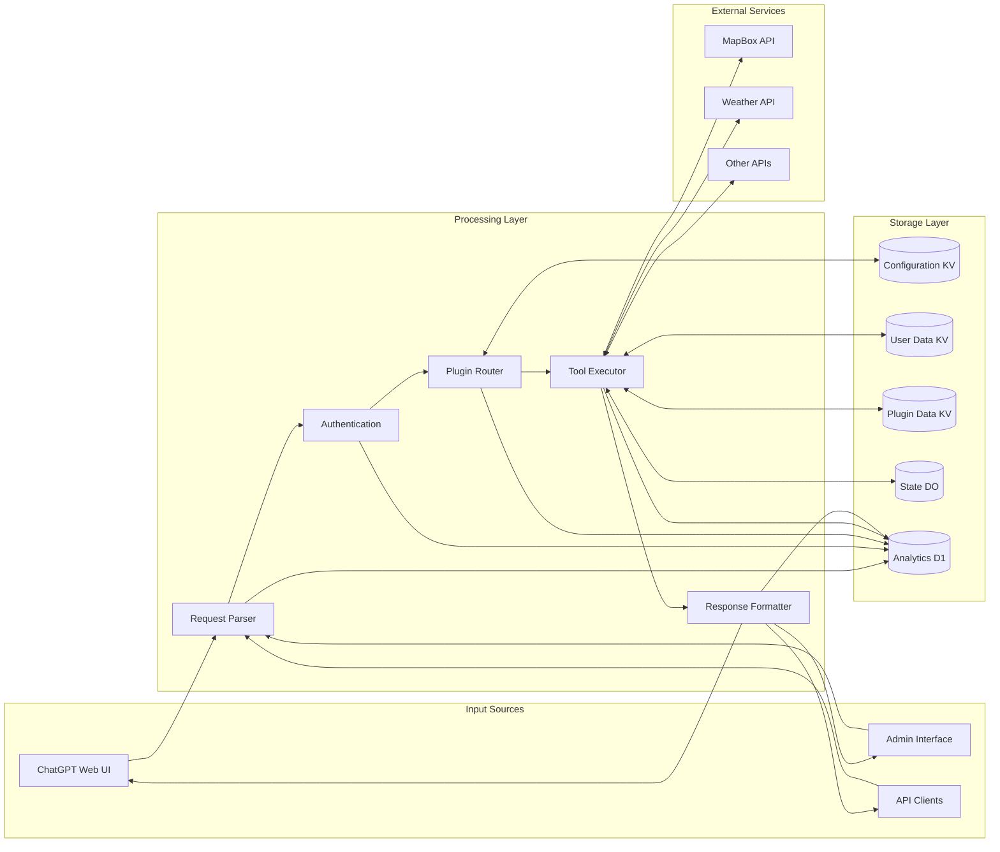

# Data Flow Diagram

This diagram illustrates how data flows through the MCP Server system, showing the movement of data between different components and external systems.

## Data Flow Description

### Input Sources

These are the entry points for data into the system.

#### ChatGPT Web UI

The primary interface for end users, where they interact with the MCP Server through ChatGPT.

**Data Sent**:
- Tool discovery requests
- Tool execution requests
- Authentication tokens

**Data Received**:
- Tool discovery responses
- Tool execution results
- Error messages

#### Admin Interface

The interface for system administrators to manage the MCP Server.

**Data Sent**:
- Configuration changes
- Plugin management commands
- User management commands

**Data Received**:
- System status information
- Configuration data
- Plugin information
- User information

#### API Clients

Other applications that interact with the MCP Server directly through its API.

**Data Sent**:
- API requests
- Authentication tokens

**Data Received**:
- API responses
- Error messages

### Processing Layer

This layer processes incoming requests and produces responses.

#### Request Parser

Parses incoming requests to determine their type and extract parameters.

**Input Data**:
- Raw HTTP requests
- Request headers
- Request body

**Output Data**:
- Parsed request type
- Parsed parameters
- Validation results

#### Authentication

Validates authentication tokens and checks permissions.

**Input Data**:
- Authentication tokens
- User identifiers
- Requested action

**Output Data**:
- Authentication result
- Permission check result
- User information

#### Plugin Router

Routes requests to the appropriate plugin based on the requested tool.

**Input Data**:
- Parsed request
- Tool identifier
- Plugin registry data

**Output Data**:
- Plugin identifier
- Tool identifier
- Forwarded parameters

#### Tool Executor

Executes the requested tool operation within the selected plugin.

**Input Data**:
- Plugin identifier
- Tool identifier
- Tool parameters

**Output Data**:
- Execution result
- Execution metadata
- Error information (if any)

#### Response Formatter

Formats the execution result into a standardized response format.

**Input Data**:
- Execution result
- Request context
- Error information (if any)

**Output Data**:
- Formatted response
- HTTP status code
- Response headers

### Storage Layer

This layer stores and retrieves data used by the system.

#### Configuration KV

Stores system configuration data in a key-value store.

**Stored Data**:
- System settings
- Environment variables
- Feature flags
- Global configuration

#### User Data KV

Stores user-specific data in a key-value store.

**Stored Data**:
- User profiles
- User preferences
- Authentication tokens
- Usage quotas

#### Plugin Data KV

Stores plugin-specific data in a key-value store.

**Stored Data**:
- Plugin registry
- Plugin configuration
- Plugin metadata
- Plugin versioning information

#### State DO

Manages stateful operations using Durable Objects.

**Stored Data**:
- Session state
- Long-running operations
- Real-time collaboration data
- Websocket connections

#### Analytics D1

Stores analytics data in a relational database.

**Stored Data**:
- Request logs
- Usage metrics
- Performance metrics
- Error logs

### External Services

These are external systems that the MCP Server interacts with.

#### MapBox API

Provides mapping and location-based services.

**Data Sent**:
- Map rendering requests
- Route optimization requests
- POI lookup requests

**Data Received**:
- Map tiles
- Route information
- POI data

#### Weather API

Provides weather data and forecasts.

**Data Sent**:
- Weather data requests
- Forecast requests
- Weather alert requests

**Data Received**:
- Current weather data
- Weather forecasts
- Weather alerts

#### Other APIs

Other external services that plugins may interact with.

**Data Sent**:
- Service-specific requests
- Authentication information

**Data Received**:
- Service-specific responses
- Error information

## Data Flow Patterns

### Request-Response Flow

1. A request enters the system from an input source.
2. The request is parsed and validated.
3. Authentication and permissions are checked.
4. The request is routed to the appropriate plugin.
5. The tool is executed within the plugin.
6. The result is formatted into a response.
7. The response is returned to the input source.

### Data Storage Flow

1. Configuration data is read from Configuration KV when needed.
2. User data is read from and written to User Data KV.
3. Plugin data is read from and written to Plugin Data KV.
4. Stateful operations use State DO for persistence.
5. Analytics data is written to Analytics D1 for reporting.

### External Service Integration Flow

1. A tool execution requires data from an external service.
2. The tool sends a request to the external service.
3. The external service processes the request and returns a response.
4. The tool processes the response and incorporates it into the result.
5. The result is returned through the normal response flow.

## Data Security Considerations

1. **Authentication**: All data flows through the Authentication component, which validates tokens and checks permissions.

2. **Encryption**: Sensitive data is encrypted in transit and at rest.

3. **Rate Limiting**: Input sources are subject to rate limiting to prevent abuse.

4. **Data Validation**: All input data is validated before processing.

5. **Audit Logging**: Data access and modifications are logged for auditing purposes.

6. **Access Control**: Data access is controlled by user permissions and roles.

7. **External Service Security**: Communication with external services uses secure channels and appropriate authentication.
