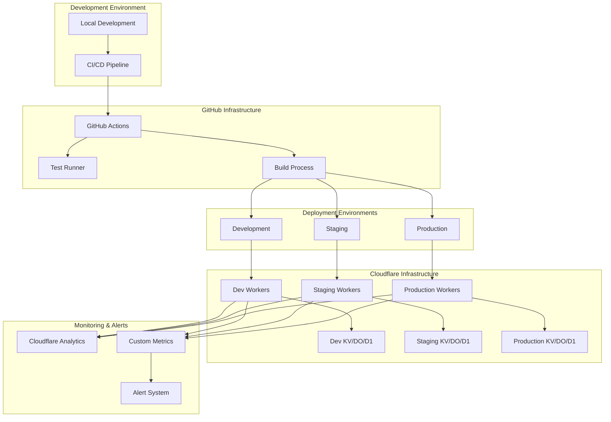

# Deployment Architecture

This diagram illustrates the deployment architecture of the MCP Server on Cloudflare's infrastructure, including the CI/CD pipeline and production environment.

## Deployment Architecture Description

### Development Environment

The starting point for development and the source of deployments.

#### Local Development

Developers work on their local machines, implementing features and fixing bugs.

**Components**:
- Local development server
- Wrangler CLI for local testing
- IDE with debugging tools
- Local testing environment

### GitHub Infrastructure

The CI/CD pipeline that builds, tests, and deploys the code.

#### GitHub Actions

Automated workflows that run on GitHub's infrastructure.

**Components**:
- Workflow definitions
- Environment secrets
- Access control
- Event triggers

#### Test Runner

Runs automated tests to ensure code quality.

**Components**:
- Unit tests
- Integration tests
- End-to-end tests
- Linting and code quality checks

#### Build Process

Builds the code for deployment.

**Components**:
- Dependency installation
- Code compilation
- Asset optimization
- Package creation

### Deployment Environments

The different environments where the code is deployed.

#### Development

The environment for testing new features during development.

**Characteristics**:
- Frequent deployments
- Isolated data
- Lower reliability requirements
- Debugging tools enabled

#### Staging

The environment for pre-production testing.

**Characteristics**:
- Production-like configuration
- Test data
- Release candidate testing
- Integration testing

#### Production

The live environment used by end users.

**Characteristics**:
- Stable releases
- Live data
- High reliability requirements
- Performance optimization

### Cloudflare Infrastructure

The cloud infrastructure where the MCP Server is deployed.

#### Workers

Serverless compute platform for running the MCP Server code.

**Deployment Types**:
- **Dev Workers**: For development testing
- **Staging Workers**: For pre-production validation
- **Production Workers**: For live user traffic

**Characteristics**:
- Global deployment
- Edge execution
- Low latency
- Auto-scaling

#### Storage Services

Cloudflare services for data storage and state management.

**Services**:
- **KV**: Key-value storage for configuration and lightweight data
- **DO**: Durable Objects for stateful operations
- **D1**: SQL database for relational data
- **R2**: Object storage for files and larger data

#### Domains and DNS

Configuration for routing traffic to the MCP Server.

**Components**:
- Custom domains
- DNS configuration
- SSL certificates
- Access policies

### Monitoring & Alerts

Systems for monitoring the health and performance of the MCP Server.

#### Cloudflare Analytics

Built-in analytics provided by Cloudflare.

**Metrics**:
- Request volume
- CPU usage
- Memory usage
- Error rates
- Cache performance

#### Custom Metrics

Custom metrics collected by the MCP Server.

**Metrics**:
- API usage
- Tool execution counts
- Response times
- Plugin performance
- User activity

#### Alert System

System for notifying administrators of issues.

**Components**:
- Alert rules
- Notification channels
- Escalation policies
- Incident management

## Deployment Process

The process of deploying the MCP Server from development to production.

### 1. Development Phase

1. **Local Development**:
   - Developers implement features and fix bugs locally.
   - Local testing using Wrangler CLI.
   - Code committed to feature branches.

2. **Pull Request**:
   - Developer creates a pull request.
   - CI pipeline runs tests automatically.
   - Code review by other developers.

### 2. Integration Phase

1. **Merge to Main**:
   - After approval, code is merged to the main branch.
   - CI pipeline runs tests on the main branch.

2. **Development Deployment**:
   - Code is automatically deployed to the Development environment.
   - Developer verification in the Development environment.

### 3. Release Phase

1. **Release Branch**:
   - Release branch created from main.
   - Version tagging and release notes.

2. **Staging Deployment**:
   - Code is deployed to the Staging environment.
   - QA testing in the Staging environment.
   - Performance testing and validation.

3. **Production Deployment**:
   - After approval, code is deployed to Production.
   - Gradual rollout using traffic percentage.
   - Monitoring for any issues post-deployment.

### 4. Monitoring Phase

1. **Performance Monitoring**:
   - Monitoring of system performance in Production.
   - Alerting for any anomalies or issues.

2. **Usage Analytics**:
   - Collection and analysis of usage data.
   - Identification of optimization opportunities.

## Rollback Procedure

In case of issues with a deployment, the following rollback procedure is implemented:

1. **Immediate Rollback**:
   - If critical issues are detected, the previous version is immediately deployed.

2. **Traffic Shifting**:
   - Alternatively, traffic is gradually shifted back to the previous version.

3. **Root Cause Analysis**:
   - Investigation of the issue to determine the root cause.
   - Fix implementation and testing.

4. **Re-deployment**:
   - After fixing the issue, the fixed version is deployed following the normal deployment process.

## Scaling Considerations

The MCP Server is designed to scale automatically with traffic, but the following considerations should be kept in mind:

1. **Workers Scaling**:
   - Cloudflare Workers scale automatically based on traffic.
   - No manual scaling is required.

2. **Storage Scaling**:
   - KV, DO, and D1 have usage limits that should be monitored.
   - Consider splitting data across multiple namespaces if approaching limits.

3. **Rate Limiting**:
   - Implement rate limiting to prevent abuse.
   - Adjust rate limits based on observed usage patterns.

4. **Cost Optimization**:
   - Monitor usage and costs.
   - Optimize code and storage usage to minimize costs.
