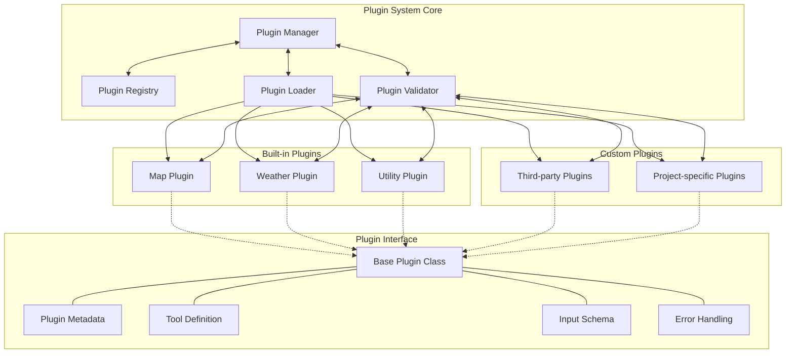

# Plugin System Architecture

This diagram illustrates the architecture of the plugin system, showing how plugins are organized, loaded, and managed within the MCP Server.

## Plugin System Components

### Plugin System Core

The core components of the plugin system are responsible for managing, loading, and validating plugins.

#### Plugin Manager

The central component that orchestrates the plugin ecosystem.

**Responsibilities**:
- Maintaining the plugin registry
- Loading and unloading plugins
- Managing plugin lifecycle
- Routing tool execution requests
- Validating plugin integrity

#### Plugin Registry

A data store that maintains information about all registered plugins.

**Responsibilities**:
- Storing plugin metadata
- Tracking plugin versions
- Maintaining dependency relationships
- Storing plugin configuration

#### Plugin Loader

Responsible for loading plugin code and initializing plugin instances.

**Responsibilities**:
- Importing plugin code
- Instantiating plugin classes
- Initializing plugin dependencies
- Managing plugin resources

#### Plugin Validator

Validates plugins to ensure they meet the system requirements and follow the plugin interface.

**Responsibilities**:
- Checking plugin interface compliance
- Validating tool definitions
- Checking parameter schemas
- Verifying dependencies

### Plugin Interface

The interface that all plugins must implement, defining how they interact with the system.

#### Base Plugin Class

An abstract base class that all plugins inherit from, providing common functionality.

**Responsibilities**:
- Implementing the plugin interface
- Providing common utility methods
- Handling standard error cases
- Managing plugin lifecycle

#### Plugin Metadata

Information about a plugin that helps identify and manage it.

**Components**:
- Name
- Version
- Description
- Author
- Dependencies
- Configuration options

#### Tool Definition

The definition of a tool provided by a plugin, including its parameters and return values.

**Components**:
- Name
- Description
- Parameter definitions
- Return value definition
- Examples
- Documentation links

#### Input Schema

The schema for tool parameters, used for validation.

**Components**:
- Parameter names
- Parameter types
- Required/optional flags
- Default values
- Validation rules

#### Error Handling

Standardized error handling for plugins.

**Components**:
- Error types
- Error codes
- Error messages
- Error recovery strategies

### Built-in Plugins

Plugins that are included with the system by default.

#### Map Plugin

Provides mapping and routing capabilities.

**Tools**:
- Route optimization
- Map rendering
- Points of interest

#### Weather Plugin

Provides weather data and forecasting.

**Tools**:
- Current weather
- Weather forecasting
- Weather alerts
- Route weather analysis

#### Utility Plugin

Provides common utility functions.

**Tools**:
- Data formatting
- Text processing
- URL manipulation
- Data validation

### Custom Plugins

Plugins that are developed by third parties or for specific projects.

#### Third-party Plugins

Plugins developed by external developers and organizations.

**Examples**:
- Data integration plugins
- Analytics plugins
- External API integrations
- Specialized tools

#### Project-specific Plugins

Plugins developed for specific projects or use cases.

**Examples**:
- Custom business logic
- Project-specific integrations
- Specialized tools for specific domains

## Plugin Lifecycle

1. **Registration**:
   - The plugin is registered with the Plugin Manager.
   - Its metadata is stored in the Plugin Registry.

2. **Validation**:
   - The Plugin Validator checks the plugin for compliance.
   - Any validation errors are reported.

3. **Loading**:
   - The Plugin Loader loads the plugin code.
   - The plugin is instantiated and initialized.

4. **Activation**:
   - The plugin is activated and made available for use.
   - Its tools are added to the tool discovery list.

5. **Usage**:
   - The plugin's tools are executed in response to requests.
   - The plugin performs its operations and returns results.

6. **Deactivation**:
   - The plugin is deactivated when no longer needed.
   - Its resources are released.

7. **Unloading**:
   - The plugin is unloaded from memory.
   - Its entry is removed from the Plugin Registry.

## Plugin Development

Creating a new plugin involves the following steps:

1. **Define Metadata**:
   - Specify plugin name, version, description, etc.

2. **Implement Interface**:
   - Extend the Base Plugin Class.
   - Implement required methods.

3. **Define Tools**:
   - Specify tool names, descriptions, and parameters.
   - Implement tool logic.

4. **Handle Errors**:
   - Implement error handling for edge cases.
   - Follow standard error patterns.

5. **Test**:
   - Test plugin functionality.
   - Validate interface compliance.

6. **Package**:
   - Package the plugin for distribution.
   - Include documentation.

7. **Deploy**:
   - Register the plugin with the Plugin Manager.
   - Activate the plugin for use.
