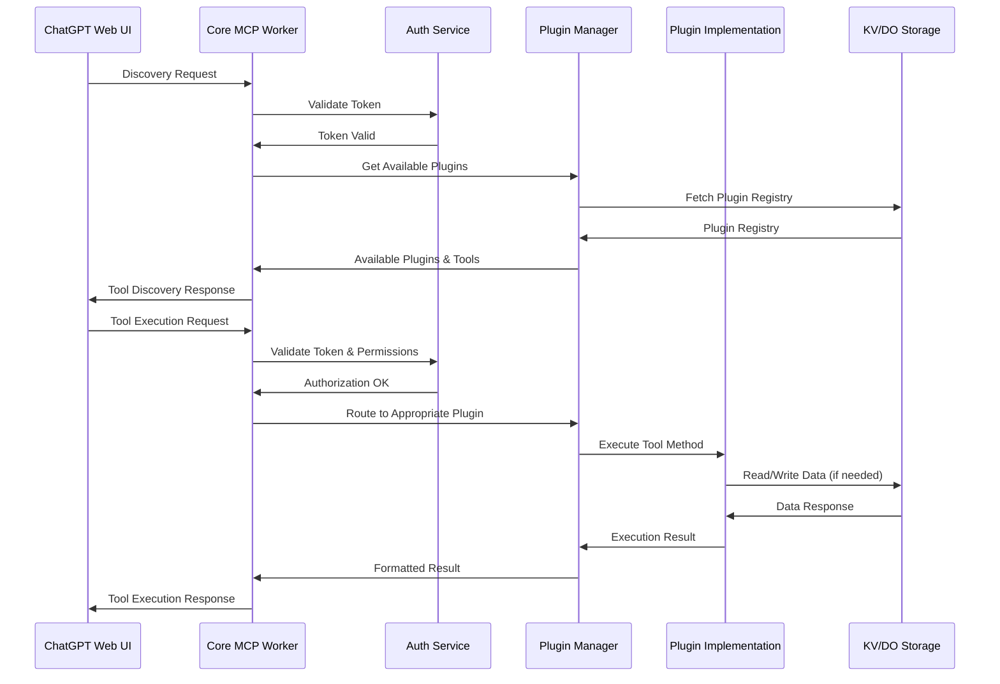

# Request Flow Sequence Diagram

This diagram illustrates the flow of requests through the MCP Server system, showing how different components interact during tool discovery and execution.

## Request Flow Description

The MCP Server handles two primary types of requests from ChatGPT: discovery requests and tool execution requests.

### Discovery Request Flow

1. **ChatGPT Web UI → Core MCP Worker**: 
   - ChatGPT sends a discovery request to the MCP Server.
   - This request asks for information about available tools.

2. **Core MCP Worker → Auth Service**:
   - The MCP Worker validates the authentication token.
   - This ensures the request is coming from an authorized source.

3. **Auth Service → Core MCP Worker**:
   - The Auth Service confirms the token is valid.
   - It may also check permissions for specific tools.

4. **Core MCP Worker → Plugin Manager**:
   - The MCP Worker requests information about available plugins and their tools.

5. **Plugin Manager → Storage**:
   - The Plugin Manager queries the storage layer for the plugin registry.
   - This registry contains information about all registered plugins.

6. **Storage → Plugin Manager**:
   - The storage layer returns the plugin registry data.

7. **Plugin Manager → Core MCP Worker**:
   - The Plugin Manager returns a list of available plugins and their tools.
   - This includes metadata, descriptions, and parameter definitions.

8. **Core MCP Worker → ChatGPT Web UI**:
   - The MCP Worker formats the discovery response.
   - It sends this response back to ChatGPT, which can now display the available tools to the user.

### Tool Execution Request Flow

1. **ChatGPT Web UI → Core MCP Worker**:
   - ChatGPT sends a tool execution request.
   - This includes the tool name and parameters.

2. **Core MCP Worker → Auth Service**:
   - The MCP Worker validates the authentication token.
   - It also checks if the user has permission to execute the specific tool.

3. **Auth Service → Core MCP Worker**:
   - The Auth Service confirms the authorization is valid.

4. **Core MCP Worker → Plugin Manager**:
   - The MCP Worker routes the execution request to the Plugin Manager.
   - It includes the tool name and parameters.

5. **Plugin Manager → Plugin Implementation**:
   - The Plugin Manager identifies the plugin that provides the requested tool.
   - It forwards the execution request to the specific plugin implementation.

6. **Plugin Implementation → Storage** (if needed):
   - The plugin may need to read or write data.
   - It interacts with the storage layer (KV, Durable Objects, D1, etc.).

7. **Storage → Plugin Implementation** (if needed):
   - The storage layer returns any requested data.

8. **Plugin Implementation → Plugin Manager**:
   - The plugin executes the tool operation.
   - It returns the execution result to the Plugin Manager.

9. **Plugin Manager → Core MCP Worker**:
   - The Plugin Manager forwards the execution result.
   - It may perform additional formatting or validation.

10. **Core MCP Worker → ChatGPT Web UI**:
    - The MCP Worker formats the execution response.
    - It sends this response back to ChatGPT, which can display the results to the user.

## Error Handling

Not shown in the diagram for simplicity, but error handling occurs at each step:

1. **Authentication Errors**: If the token is invalid, the Auth Service returns an error, and the MCP Worker returns an authentication error to ChatGPT.

2. **Plugin Not Found**: If the requested tool doesn't exist, the Plugin Manager returns an error, and the MCP Worker returns a "tool not found" error to ChatGPT.

3. **Execution Errors**: If the plugin encounters an error during execution, it returns an error, which is propagated back to ChatGPT.

4. **Storage Errors**: If the storage layer encounters an error, it's returned to the plugin, which may handle it or propagate it back.

## Rate Limiting and Throttling

Also not shown, but the Auth Service implements rate limiting to prevent abuse:

1. **Request Counting**: The Auth Service tracks request counts per user/token.

2. **Throttling**: If a user exceeds their rate limit, requests are rejected with a "rate limit exceeded" error.

3. **Quota Management**: Usage quotas may be enforced based on user tiers or subscription levels.
