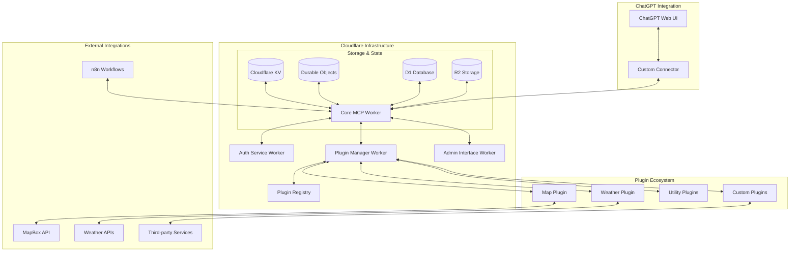

# System Architecture Overview

This diagram illustrates the high-level architecture of the Cloudflare-based MCP Server system, showing the relationships between different components and how they interact with external systems.

## Component Descriptions

### ChatGPT Integration
- **ChatGPT Web UI**: The user interface where users interact with ChatGPT.
- **Custom Connector**: The connector in ChatGPT that allows integration with the MCP server.

### Cloudflare Infrastructure
- **Core MCP Worker**: The central component that implements the Model Context Protocol.
- **Auth Service Worker**: Handles authentication and authorization.
- **Plugin Manager Worker**: Manages the plugin ecosystem.
- **Admin Interface Worker**: Provides an administrative interface for managing the system.
- **Plugin Registry**: Stores information about available plugins.

### Storage & State
- **Cloudflare KV**: Key-value storage for configuration and lightweight data.
- **Durable Objects**: Provides stateful capabilities for the system.
- **D1 Database**: Relational database for structured data.
- **R2 Storage**: Object storage for files and larger data.

### Plugin Ecosystem
- **Map Plugin**: Provides mapping and routing capabilities.
- **Weather Plugin**: Provides weather data and forecasting.
- **Utility Plugins**: Provides common utility functions.
- **Custom Plugins**: Custom plugins developed for specific needs.

### External Integrations
- **MapBox API**: External mapping service used by the Map Plugin.
- **Weather APIs**: External weather data services used by the Weather Plugin.
- **Third-party Services**: Other external services integrated through custom plugins.
- **n8n Workflows**: Integration with n8n for workflow automation.

## Key Relationships

1. The ChatGPT Web UI communicates with the MCP server through the Custom Connector.
2. The Core MCP Worker orchestrates the system, communicating with Auth, Plugin Manager, and Admin components.
3. Plugins are managed by the Plugin Manager and provide specific functionality.
4. External services are integrated through plugins, providing data and functionality.
5. Storage services provide persistence and state management for the system.

## System Flow

1. Users interact with ChatGPT through the Web UI.
2. The Custom Connector forwards requests to the Core MCP Worker.
3. The Core MCP Worker authenticates requests through the Auth Service.
4. The Core MCP Worker routes requests to the appropriate plugin.
5. Plugins execute the requested operation, potentially interacting with external services.
6. Results are returned to the Core MCP Worker, which formats and returns them to ChatGPT.
7. ChatGPT presents the results to the user.
