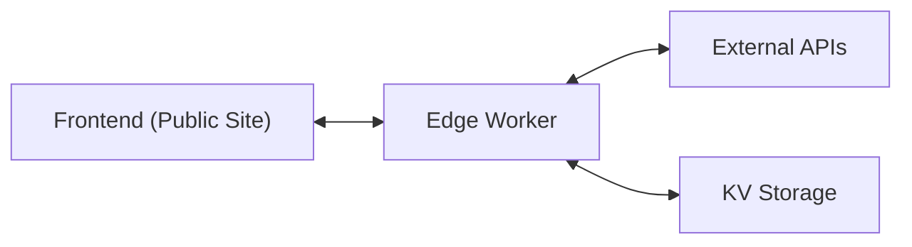

# 48 Continental USA - Copilot Chat Context

This document provides comprehensive context about the 48 Continental USA (The Wandering Whittle) project for Copilot Chat. It captures essential architectural details, dependencies, recurring issues, and deployment procedures to maintain consistent knowledge and accelerate issue resolution.

## Project Overview

The 48 Continental USA project tracks a Tesla road trip through all 48 contiguous US states, featuring:

- Real-time vehicle tracking on an interactive map
- Trip statistics and progress display
- Weather and charging station integration
- State tracking for visited states

## System Architecture



### Core Components

1. **Frontend (Public Site)**
   - **Technology**: React 18, Vite, MapBox GL JS
   - **Deployment**: Cloudflare Pages
   - **URL**: [main.continentalusa-site.pages.dev](https://main.continentalusa-site.pages.dev)
   - **Repository Path**: `48Continental_Starter/public-site/`

2. **Edge Worker**
   - **Technology**: Cloudflare Workers (TypeScript)
   - **URL**: [thewanderingwhittle-edge.workers.dev](https://thewanderingwhittle-edge.kd8jc7v8cd.workers.dev)
   - **Repository Path**: `edge-worker/`
   - **Responsibilities**: API proxy, data aggregation, WebSocket streaming
   - **KV Storage**: ITINERARY_KV, APP_KV (for persistent data)

3. **External APIs**
   - Tessie API: Vehicle telemetry data
   - OpenWeather API: Weather data for route
   - MapBox API: Map rendering services
   - ABRP API: Route planning and charging stations

## Recurring Issues & Solutions

### Map Loading Issues

1. **Symptom**: Perpetual loading spinner on map
   - **Root Cause**: MapBox token loading incorrectly from environment variables
   - **Solution**: Use hardcoded token in `src/components/Map.jsx`
   - **Token**: `your_mapbox_token_here` (Configure in environment variables)

2. **Symptom**: Map loads but vehicle doesn't appear
   - **Root Cause**: Vehicle data API connection failure
   - **Solution**: Set `VITE_USE_SIMULATED_DATA=true` in .env for fallback

3. **Symptom**: Console errors about MapBox GL JS
   - **Root Cause**: CSS/JS resources loading in incorrect order
   - **Solution**: Ensure mapbox-gl CSS import before Map component initialization

### Deployment Issues

1. **Symptom**: Only partial files deployed to production
   - **Root Cause**: Build process interrupted (exit code 130) due to resource limitations
   - **Solution**: Ensure clean build environment, no background processes consuming resources

2. **Symptom**: Project name mismatch
   - **Root Cause**: Different names in wrangler.toml vs deployment scripts
   - **Solution**: Use "continentalusa-site" consistently in all config files

3. **Symptom**: Environment variables missing in production
   - **Root Cause**: Environment files not properly included in build
   - **Solution**: Add to Cloudflare Pages environment variables or ensure .env.production is used

## Build & Deployment Requirements

### Edge Worker Deployment

1. **Prerequisites**:
   - Valid Cloudflare API token with Worker permissions
   - Environment variables set in `.dev.vars`:
   
     ```shell
     TESSIE_API_TOKEN=your-tessie-api-token
     TESSIE_VIN=your-tesla-vehicle-vin
     OPENWEATHER_API_KEY=your-openweather-api-key
     EDGE_HMAC_KEY=your-hmac-secret-key
     ```

2. **Deployment Commands**:
   
   ```bash
   cd edge-worker
   npm install
   npm run build
   npx wrangler deploy
   ```

3. **Verification**:
   - Check endpoint: [thewanderingwhittle-edge.workers.dev/health](https://thewanderingwhittle-edge.kd8jc7v8cd.workers.dev/health)
   - Verify KV bindings: APP_KV, ITINERARY_KV

### Public Site Deployment

1. **Prerequisites**:
   - Node Version: >=20.0.0
   - Environment variables in `.env`:
   
     ```shell
     VITE_EDGE_WORKER_URL=https://thewanderingwhittle-edge.kd8jc7v8cd.workers.dev
     VITE_MAPBOX_TOKEN=your_mapbox_token_here
     VITE_API_BASE_URL=https://thewanderingwhittle-edge.kd8jc7v8cd.workers.dev
     VITE_USE_SIMULATED_DATA=true
     ```

2. **Deployment Commands**:
   
   ```bash
   cd 48Continental_Starter/public-site
   npm install
   npm run build
   npx wrangler pages deploy dist --project-name continentalusa-site
   ```

3. **Verification**:
   - Check deployment: [main.continentalusa-site.pages.dev](https://main.continentalusa-site.pages.dev)
   - Verify map loads and displays vehicle data
   - Run verification script: `./verify-site.sh`

## Verification Resources

### Automated Verification

The project includes automated verification tools to confirm site functionality:

1. **Verification Script** (`verify-site.sh`):
   - Checks site availability
   - Verifies API endpoints
   - Confirms resource loading
   - Generates verification report

2. **Verification Checklist** (`verification-checklist.md`):
   - Core map functionality
   - Vehicle data display
   - Journey information
   - UI components
   - Error handling

### Site Baseline

The `SITE_BASELINE.md` document establishes the expected functionality:

1. **Map Display**: Load completely, show route path, display waypoints
2. **Vehicle Data**: Show current location, stats, battery level
3. **Journey Information**: Display itinerary, timing, highlight current stop
4. **States Tracking**: Count states visited, highlight current state
5. **UI Navigation**: Working tabs, proper sizing, state maintenance

## Recovery Process

If the site is not functioning properly:

1. **Verify Edge Worker**: Check [thewanderingwhittle-edge.workers.dev](https://thewanderingwhittle-edge.kd8jc7v8cd.workers.dev)
2. **Check Map Token**: Ensure Map.jsx has hardcoded MapBox token
3. **Enable Simulated Data**: Set `VITE_USE_SIMULATED_DATA=true` in .env
4. **Deploy Complete Build**: Ensure full dist directory uploads to Cloudflare
5. **Reference Working Code**: See recovery/map-integration-restored branch (commit 73a0dd7)
6. **Run Verification**: Use verify-site.sh and verification-checklist.md

## Reference Deployments

- **Working Deployment**: [7d907a37.continentalusa-site.pages.dev](https://7d907a37.continentalusa-site.pages.dev)
- **Reference Branch**: recovery/map-integration-restored
- **Reference Commit**: 73a0dd7

## Common Terminal Commands

```bash
# Build and deploy Edge Worker
cd edge-worker
npm install
npm run build
npx wrangler deploy

# Build and deploy Public Site
cd 48Continental_Starter/public-site
npm install
npm run build
npx wrangler pages deploy dist

# Verify deployments
./scripts/verify-deployment.sh

# Run pre-deployment checks
npm run pre-deploy

# Deploy all components
./scripts/deploy-all.sh
```

## Environment Variables Reference

| Variable | Component | Purpose | Required Value |
|----------|-----------|---------|---------------|
| VITE_EDGE_WORKER_URL | Public Site | API endpoint | [Edge Worker URL](https://thewanderingwhittle-edge.kd8jc7v8cd.workers.dev) |
| VITE_API_BASE_URL | Public Site | API endpoint | Should match VITE_EDGE_WORKER_URL |
| VITE_MAPBOX_TOKEN | Public Site | Map rendering | your_mapbox_token_here |
| VITE_USE_SIMULATED_DATA | Public Site | Data fallback | true |
| TESSIE_API_TOKEN | Edge Worker | Tesla API access | Your Tessie token |
| TESSIE_VIN | Edge Worker | Vehicle identifier | Your Tesla VIN |
| EDGE_HMAC_KEY | Edge Worker | Authentication | Secret HMAC key |

## VS Code Tasks

Several VS Code tasks are available for common operations:

- **Pre-deploy Checks**: Verifies build requirements are met
- **Deploy All**: Runs complete deployment script
- **Build Edge Worker**: Builds only the Edge Worker component
- **Deploy: Edge Worker**: Deploys only the Edge Worker
- **Map Integration Diagnostics**: Runs tests for map integration

Use the VS Code Command Palette and select "Run Task" to access these tasks.
